# AI Abilities

The AI Abilities website is a site that is designed to bring awareness of artificial intelligence and its capabilities.

Users will get a better understanding of what AI is and will be able to watch a video link with a list of thirty different things AI can do as well as look at the gallery page which displays some images created by AI. There is also a register page for the user to receive updates on new AI developments, this site is targeted to all ages and for anyone who wants to learn more about AI.

 ### FEATURES  
- The Header
   * The header shows the logo AI Abilities in color blue chosen to contrast the background image along with the  other navigation links.
   * The logo explains in short what the website entitles.

   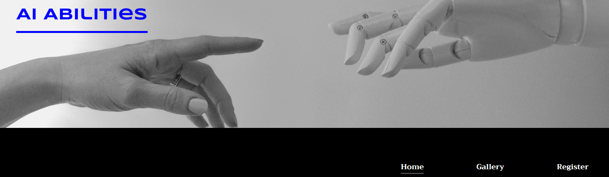

- Navigation
  
    *  Towards the top left of the page there is the sites navigation logo AI Abilities, this is located at the top left corner of all three pages for consistency and when clicked will bring the user back to the top of the homepage.
    * The other navigation links are located on the right hand side under the header image: Home, Gallery, Register which link to different sections of the site on different pages, these maintain formation on all pages for consistency.
    * The navigation logo is colored blue consistent on all three pages and is in a font that looks robotic.
    * The other navigation links are colored white that contrasts with the background and are font : Trirong which is a font that is easy to read for viewers with vision impairment.
    * The navigation links makes the viewers experience easier when navigating through the site as they are not required to use the return button.

    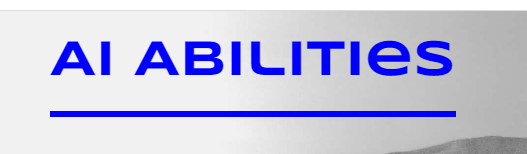 

- AI Info Section
  * The Ai info section gives the users detail on what artificial intelligence is and gives some examples in where Ai is used and what it is used for.

  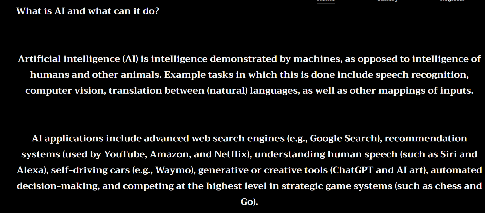

- Youtube video
  * This section provides the user with a youtube video link that demonstrates up to thirty different things artificial intelligence is capable of. 
  * This video is important for the user as it allows them to watch Ai can do when being commanded.

  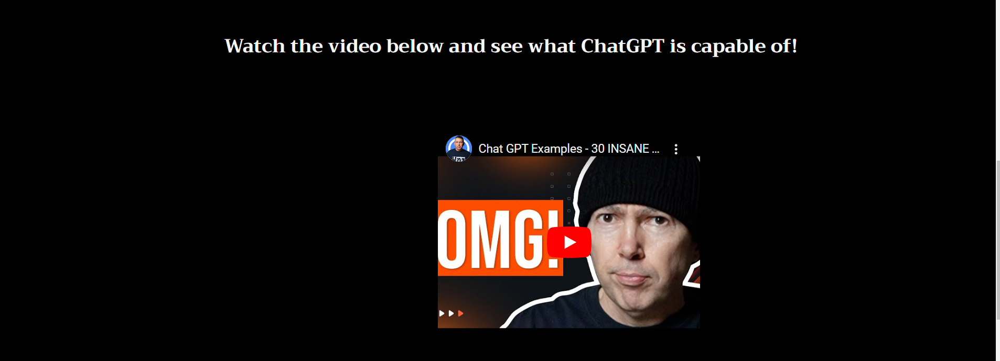

- Social media
   * There is a short sentence  encouraging the user to click the gallery link at the top of the page to view some of the art created by Ai
   * This section provides the user with our social media links and encourages the user to follow us on social media where they will be able to see more Ai abilities.

   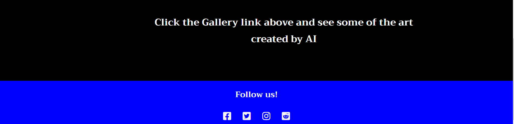

- Art Gallery
   * This section provides some images that have been created by Ai allowing them to see how realistic some images can be and how detailed others are.
   * This section also lets the user know that they are able to register to the site to receive updates on new developments and join the sites online debate.

   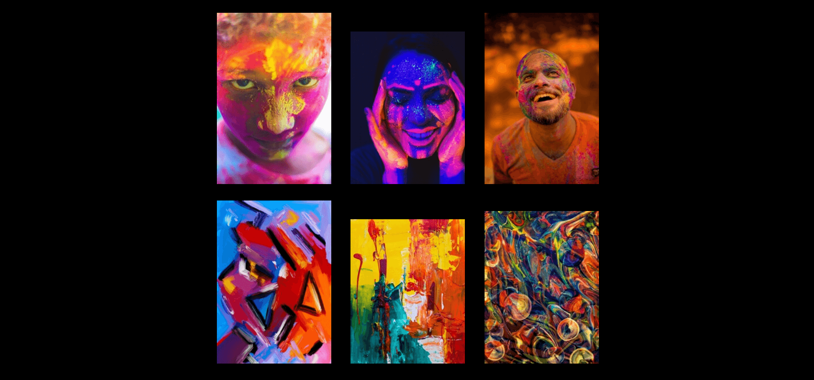
   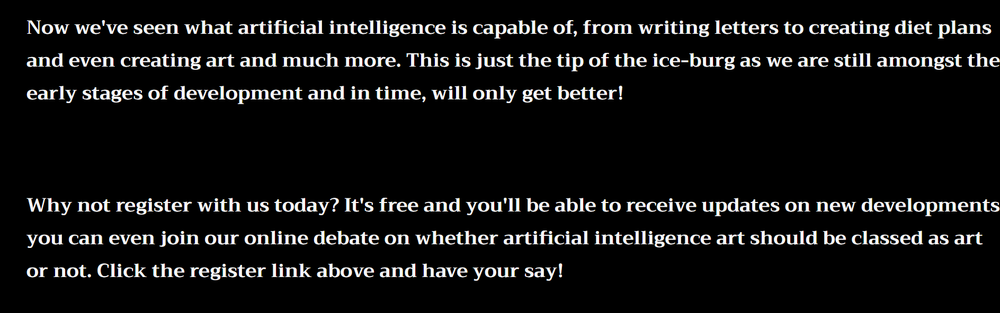

- Register 
   * The register section has a form to collect information from the user so they can sign up to AI Abilities.
   * The form collects the users first name, last name and email address.
   * The form is valuable to the user as it allows them to register to AI Abilities and receive development updates with artificial intelligence and allows them to join the sites online debate.

   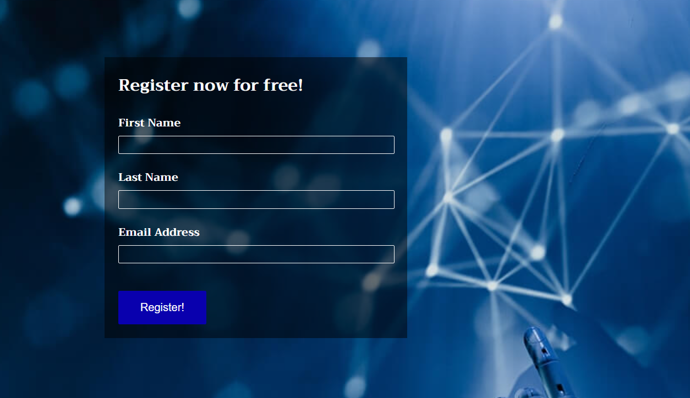

   ### Testing

  - I have tested that the page works on different browsers: Microsoft Edge, Google Chrome and Firefox and confirm it works on all three.
  - I can confirm that this project is responsive and looks good and all functions work on all screen size's using the developers tool bar.
  - I can confirm that the logo, navigation, home, gallery and register text are all readable and easy to understand.
  - I can confirm that the form works and requires entries in every field and will only accept an email address in the email section, the register button also works.

  ### Bugs
Solved bugs
 - While creating my project and testing it through the validator I had discovered some errors within the code, here are some of the errors

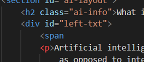
- Removing the span fixed the problem.

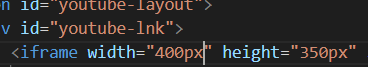
- Removing the px from the height and width fixed the problem.

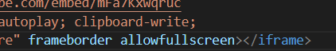
- Removing the frameborder fixed the problem.

### Validator Testing
 - HTML
   * No errors where found when passing through the official W3C validator, however I did have warning's, this was due to lack of headings in some sections which advises to use a div element instead if a heading is not needed which I have done.
 - CSS
   * No errors where found when passing through the official (Jigsaw) validator
 - Accessibility 
   * I can confirm that the colors and fonts chosen are easy to read and accessible by using the lighthouse in devtools.

   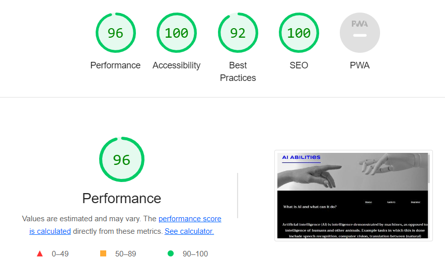
