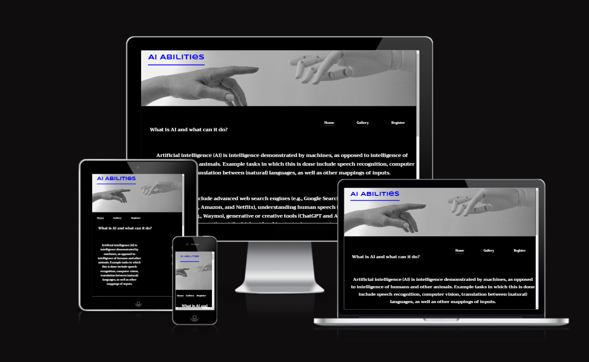

# AI Abilities

The AI Abilities website is a site that is designed to bring awareness of artificial intelligence and its capabilities.

Users will get a better understanding of what AI is and will be able to watch a video link with a list of thirty different things AI can do as well as look at the gallery page which displays some images created by AI. There is also a register page for the user to receive updates on new AI developments, this site is targeted to all ages and for anyone who wants to learn more about AI.

 ### FEATURES  
- The Header
   * The header shows the logo AI Abilities in color blue chosen to contrast the background image along with the  other navigation links.
   * The logo explains in short what the website entitles.

   

- Navigation
  
    *  Towards the top left of the page there is the sites navigation logo AI Abilities, this is located at the top left corner of all three pages for consistency and when clicked will bring the user back to the top of the homepage.
    * The other navigation links are located on the right hand side under the header image: Home, Gallery, Register which link to different sections of the site on different pages, these maintain formation on all pages for consistency.
    * The navigation logo is colored blue consistent on all three pages and is in a font that looks robotic.
    * The other navigation links are colored white that contrasts with the background and are font : Trirong which is a font that is easy to read for viewers with vision impairment.
    * The navigation links makes the viewers experience easier when navigating through the site as they are not required to use the return button.

     